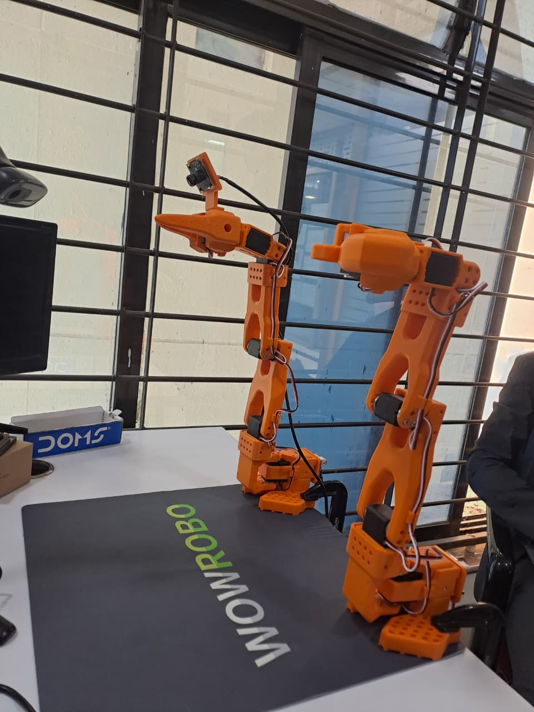
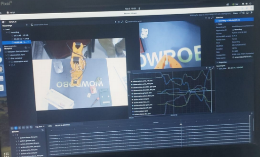

# End_Sem_SOARM101_LeRobot

This project contains the final SOARM101 practical work done using the LeRobot framework.

## ✅ File Included
- **soarm101.ipynb**  
  Jupyter Notebook containing all code, explanation, outputs and steps for running LeRobot tasks.

## ✅ Output Images

### 1. Robot Execution Screenshot


### 2. Dataset or Terminal Output



## ✅ How to Run the Notebook
Use the following command to launch Jupyter Notebook:

```bash
jupyter notebook soarm101.ipynb
```
Make sure you have activated your environment and installed required dependencies (lerobot, torch, opencv, etc.)

✅ Requirements

```bash
Python 3
Jupyter Notebook / Jupyter Lab
lerobot
torch
numpy
opencv-python
```
✅ Project Purpose

This notebook contains the implementation of LeRobot dataset handling and robot execution steps as part of the End Semester evaluation for the SOARM101 course.

## To Eval using the custom trained model for grab the eraser and place it in the white Box

Below is the command to inference

```bash
lerobot-record \
  --robot.type=so101_follower \
  --robot.port=/dev/ttyACM0 \
  --robot.id=pretty_lil_baby \
  --robot.cameras='{
    "front": {
      "type": "opencv",
      "index_or_path": 0,
      "width": 640,
      "height": 480,
      "fps": 30,
      "fourcc": "MJPG"
    },
    "wrist": {
      "type": "opencv",
      "index_or_path": 2,
      "width": 640,
      "height": 480,
      "fps": 30,
      "fourcc": "MJPG"
    }
  }' \
  --policy.path="/home/user/output/train/act_so101_test/checkpoints/020000/pretrained_model" \
  --policy.device="cuda" \
  --display_data=true \
  --dataset.repo_id="Harshad007/eval_so101" \
  --dataset.single_task="Grab the eraser and place it in the white box" \
  --dataset.push_to_hub=false
```


